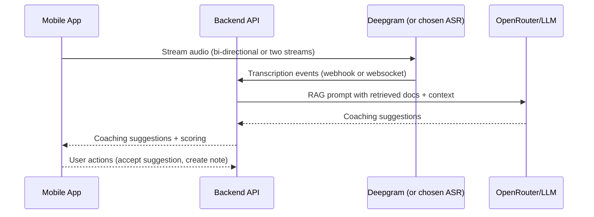

# CloseIQ — Mobile Application Development: Project Article

## **Executive Summary**

# CloseIQ — Mobile Application Development: Project Article

## **Executive Summary**

CloseIQ is a real-time sales coaching platform that listens to live calls, transcribes both sides, retrieves context from training and CRM sources, and provides instant coaching suggestions (what to say, rationale, next move, close probability). This document frames CloseIQ specifically for the Mobile Application Development assignment: a plan to duplicate and adapt the current web/electron prototype into a mobile app, document technical and non-technical considerations, explain the theory behind key components, and prepare concise answers for likely practical questions.

**This enhanced edition** expands the original draft with deeper technical explanations, concrete code examples for mobile ↔ backend streaming, deployment and scaling guidance, security and privacy checklists, evaluation metrics, and an expanded Q&A + flashcards section designed for the practical exam portion.

---

## **Why a Mobile Version?**

- Sales conversations increasingly happen on the go; mobile enables coaching in mobile-first field sales.
- Reuse of core backend (transcription, RAG, vector store, LLM) keeps implementation effort focused on the mobile client UX and low-latency streaming.
- University assignment requirement: demonstrate porting a full-stack project into a platform-specific app while preserving pipeline integrity.

---

## **Audience and Goals**

- Audience: course instructors (Mobile App Development), graders, and technical reviewers.
- Goals: produce a production-like mobile client that connects to the existing backend services, demonstrates live transcription and coaching, handles permissions and offline behavior, and includes an exam/demo script and Q&A prep.

---

## **Target Platforms and Recommended Tech Stack**

- Primary recommendation: React Native (Expo-managed or bare) to maximize code reuse from the existing React web app and share business logic, UI styles, and assets.
- Alternatives: Flutter (strong cross-platform performance), native Swift/Kotlin (best performance but higher dev time).

Suggested stack

- Mobile UI: React Native + Expo (or React Native CLI) + TypeScript
- State management: Redux Toolkit or React Context + Zustand for lightweight state
- Real-time audio & streaming: WebRTC (react-native-webrtc) or native audio stream + a streaming SDK (Deepgram Live API or WebSocket bridge)
- Networking: axios / fetch, websockets (native or library)
- Authentication: Supabase JS client (or platform-native SDK) — reuse existing Supabase setup from frontend
- Local DB (optional): SQLite via `react-native-sqlite-storage` or `WatermelonDB` for offline transcripts/notes
- Vector store & embeddings: Reuse backend (`backend/app/services/*`) — mobile only sends transcripts/segments

Note: Throughout this document file links point to the repository. Use the repo's `SERVICE_SETUP.md` to configure provider keys before running live demos.

Reference files in repo:

- Backend main entry: `backend/app/main.py`
- Routers: `backend/app/routers/file_routes.py`, `backend/app/routers/query_routes.py`
- Services: `backend/app/services/rag_service.py`, `backend/app/services/file_service.py`
- Service setup notes: `SERVICE_SETUP.md`

---

## **System Architecture (High Level)**

### **Core idea**

Keep heavy ML (LLM calls, embeddings, vector DB) on the server. The mobile client streams audio, shows live transcripts and coaching hints in real time, and optionally records session metadata to backend for later analysis.

### **Mermaid sequence (simplified)**



This sequence prioritizes a thin mobile client and a stateful backend that manages session context, partial transcripts, retrieval caches, and LLM orchestration.

---

## **Detailed Components**

### **Mobile Client**

- Microphone access and permission flows (Android/iOS differences).
- Real-time audio capture and low-latency upload.
- Displaying partial transcripts (streaming) and final segments.
- UI: live coaching panel (What to say / Why it works / Next move / Close probability) and a small feedback widget to confirm suggestion relevancy.
- Error handling for connectivity loss—queue transcript chunks and re-sync on reconnect.
- Session lifecycle: start/stop session, mute/unmute, export notes.

Implementation tip: keep audio capture and network logic in a single isolated native module (or RN hook) to make it reusable between Expo/React Native and future native ports.

### **Backend (reuse existing)**

- API endpoints in `backend/app/routers/*` for session management, file upload, and query.
- Services in `backend/app/services` for RAG, vector store (Chroma in `vector_store/`), and prompt orchestration.
- LLM provider configuration via `OPENROUTER_API_KEY` / `OPENAI_API_BASE` and embedding via `EMBEDDING_MODEL` (see `SERVICE_SETUP.md`).

### **Real-time ASR**

- Deepgram is currently wired for the frontend; mobile can use Deepgram Mobile SDK / WebSocket Live API or send streaming audio through a backend WebSocket to Deepgram.
- If Deepgram mobile SDK is unavailable, implement a small socket tunnel: client -> backend (WebSocket, RTP) -> Deepgram.

Concrete tradeoffs:

- Direct-to-ASR from mobile (lower server CPU, requires mobile secret handling or ephemeral tokens).
- Tunnel via backend (server mediates keys, easier to add business logic, slightly higher latency).

### **Vector store & RAG**

- Keep embeddings and retrieval server-side using `langchain_openai.OpenAIEmbeddings` and Chroma (the repo already contains `vector_store/` with Chroma files).
- Mobile sends short context windows (e.g., last 30s or last N transcript segments) as metadata; backend performs retrieval and LLM calls.

Design note: tune retrieval chunk sizes and `k` (top-k) to balance context relevance and LLM token cost. Typical starting values: chunk size 500-800 tokens, overlap 50-150 tokens, `k=3..5`.

--

## **Deep Technical Deep-Dive**

### ASR & Speaker Separation

- Approaches:
    - Single-stream ASR + server-side diarization (Deepgram/AssemblyAI feature): easiest to integrate but depends on quality of diarization.
    - Multi-channel capture (separate channels for closer and prospect) — ideal for speaker separation, requires two input devices or a SIP/VoIP split.
    - Voice activity and turn detection: short heuristics to detect turn boundaries and trigger RAG for each turn.

### RAG Pipeline Internals

- Chunking: split documents/playbooks into overlapping windows to preserve context.
- Embeddings: choose an embedding model with a tradeoff between cost and semantic fidelity (e.g., OpenAI text-embedding-3-small for budget, larger models for accuracy).
- Retrieval: use approximate nearest neighbor (ANN) indexing (Chroma or FAISS) for scale.
- Prompting: build a small prompt template including:
    - System instruction (coach persona + constraints)
    - Relevant retrieved docs
    - Latest N transcript turns + speaker labels
    - A short instruction asking for `what_to_say`, `why`, `next_move`, and `close_probability` (0-100)

Example prompt snippet (conceptual):

```
System: You are a concise sales coach. Be polite and action-oriented.
Context: <retrieved passages>
Transcript: [Prospect]: ... \n [Closer]: ...
Task: Produce JSON with keys: what_to_say, rationale, next_move, close_probability
```

### Prompt Engineering & Safety

- Constrain length and sanitize retrieved docs to avoid leaking PII.
- Add guardrails in the system prompt to avoid giving regulatory, legal, or medical advice.

--

## **Code Examples**

### FastAPI WebSocket audio tunnel (backend sketch)

This example shows a WebSocket route that accepts binary audio frames and relays them to an ASR provider or queue.

```python
from fastapi import FastAPI, WebSocket
from fastapi.websockets import WebSocketDisconnect
app = FastAPI()

@app.websocket('/ws/audio')
async def audio_ws(ws: WebSocket):
        await ws.accept()
        try:
                while True:
                        data = await ws.receive_bytes()
                        # enqueue `data` to the ASR pipeline or forward to Deepgram
                        # tag with session id stored in query params / headers
        except WebSocketDisconnect:
                pass
```

Notes: implement backpressure, chunk framing, and a small binary header indicating PCM format, sample rate and channel count.

### React Native: capturing and streaming microphone audio (conceptual)

Use a native audio capture library to stream short PCM chunks as ArrayBuffer over WebSocket to `/ws/audio`:

```js
const ws = new WebSocket("wss://your-backend/ws/audio?sessionId=abc");
// open mic and push frames:
// audioRecord.ondata = (pcmChunk) => ws.send(pcmChunk);
```

For production, encode audio to Opus for bandwidth savings and mark frames with timestamps.

--

## **Deployment, Scaling & Cost Considerations**

- LLM costs: estimate per-session token usage (prompt + response). For aggressive low-latency, prefer smaller models or fine-tuned assistants.
- ASR costs: billing is typically per minute; estimate usage per session.
- Chroma/FAISS: persistent vector DB storage and memory needs; scale with number of docs and queries per second.
- Horizontal scaling: stateless API servers behind a load balancer, a shared vector DB, and a queue (Redis/RabbitMQ) for asynchronous LLM calls if needed.

Suggested production stack:

- Containerize backend with the existing `Dockerfile` and use `docker-compose` for local staging. In prod, deploy to Kubernetes or a PaaS with autoscaling.

Cost-saving tips:

- Cache recent retrieval results per session to avoid repeated embedding/retrieval for high-frequency segments.
- Use streaming LLM responses to save on redundant prompt tokens when only short outputs are needed.

--

## **Observability & Ops**

- Metrics to collect: ASR latency, LLM latency, requests/sec, failed requests, cost per request, queue lengths.
- Tools: Prometheus for metrics, Grafana dashboards, Sentry for errors, ELK/Opensearch for logs.
- Alerts: high error rates, token cost spikes, ASR disconnects.

--

## **Security & Privacy Checklist (expanded)**

- Consent: explicit, persistent session consent UI.
- Transport: enforce TLS (HTTPS/WSS) for all audio and control channels.
- Storage: encrypt recordings at rest, store PII-minimized transcripts.
- Access control: role-based access in backend for deletion and viewing.
- Deletion flow: provide a user-facing deletion endpoint that removes audio, transcripts, and corresponding vectors from the index.

--

## **Evaluation Metrics & Acceptance Tests**

- ASR accuracy: Word Error Rate (WER) target (e.g., <12% for baseline English).
- Latency: median RTT for suggestion generation ≤ 3s.
- Retrieval quality: precision@k and recall@k measured against a curated test set of training docs.
- Human evaluation: A/B tests with closers to measure lift in objection handling.

Sample acceptance test cases:

- Live session shows transcript within 1s of speaking and coaching suggestion within 2s of turn end.
- Offline resume test: record 2 minutes offline and sync when Wi-Fi resumes; all segments persisted.

--

## **Expanded Practical Demo & Grading Script**

Add these checkpoints to the demo rubric for graders:

- Start-to-first-suggestion time (measure with a stopwatch).
- Correct speaker labeling in transcript for at least 80% of turns.
- A recorded session can be deleted and verified removed from vector store.

--

## **Expanded Anticipated Questions & Model Answers**

- Q: How do you measure `close_probability` reliably?
    - A: It's a heuristic score combining features extracted from the transcript (sentiment, objection presence, buying phrases), historical model outputs, and context from retrieval. Train a small classifier on historical CRM outcomes when available.

- Q: How do you handle prompt drift or hallucinations?
    - A: Constrain the model with explicit system prompts, include retrieved evidences, and add a verification step where the LLM must cite the doc ID or a doc excerpt supporting any factual claim.

- Q: How would you architect multi-tenant data separation?
    - A: Namespace each tenant's vectors/index, use per-tenant buckets/storage and strict access control on queries. Use separate DB instances or logical partitions for high-value customers.

--

## **Exam Flashcards (quick review)**

- Flashcard: "What is RAG?" → Retrieval-Augmented Generation: combine external documents + LLM to ground responses.
- Flashcard: "Why server-side embeddings?" → To centralize keys, reduce mobile complexity, reuse indexing, and maintain consistency.
- Flashcard: "What metric shows ASR quality?" → Word Error Rate (WER).

--

## **Practical Q&A: Live Coding Prompts**

- Task: Add a WebSocket `/ws/audio` route to forward audio to Deepgram — explain headers, framing, and session lifecycle.
- Task: Modify `query_routes.py` to accept short transcript windows and return a JSON suggestion object; include input validation and rate limiting.

--

## **Presentation & Slides Guidance**

- Keep slides to 10–12 slides: problem, approach, architecture diagram, live demo, metrics, risks & mitigations, next steps.
- Demo tip: use a pre-recorded audio sample for a safe, repeatable demo if live audio is unreliable.

--

## **References & Further Reading**

- Deepgram docs (real-time): https://developers.deepgram.com
- LangChain RAG patterns: https://langchain.readthedocs.io
- Chroma vector store: https://www.trychroma.com

--

## **Appendix: Repo Pointers**

- Service setup: [SERVICE_SETUP.md](SERVICE_SETUP.md)
- Backend entry: [backend/app/main.py](backend/app/main.py#L1)
- Routers: [backend/app/routers/file_routes.py](backend/app/routers/file_routes.py#L1), [backend/app/routers/query_routes.py](backend/app/routers/query_routes.py#L1)
- Services: [backend/app/services/rag_service.py](backend/app/services/rag_service.py#L1), [backend/app/services/file_service.py](backend/app/services/file_service.py#L1)
- Vector store folder: [vector_store/](vector_store/)

---

## **What's next (I can do for you)**

- Scaffold a React Native + Expo starter that streams mic audio to `ws://.../ws/audio` and displays coaching output.
- Implement a FastAPI WebSocket forwarding route and a minimal ASR relay worker.
- Generate a 10-slide presentation and a 5-minute demo script keyed to the rubric.

Tell me which of the above you'd like me to implement next and I'll add it to the plan and start coding.

---

## **Mobile-specific Implementation Details**

### Permissions & Privacy

- Request microphone permission with clear rationale.
- Provide an explicit recording consent UI (GDPR-friendly), and an option: "Local-only transcription" (device) vs "Cloud transcription".
- Encrypt audio in transit (HTTPS / WSS) and store minimal PII.

### Latency & UX

- Aim for coaching suggestions within 1–3 seconds after the speaker finishes a short turn.
- Use partial transcripts and incremental hints: show suggestions with a confidence indicator.
- Provide visual affordances: overlay coach bubble, color-coded close-probability meter.

### Battery & Data Usage

- Use lower-bitrate audio for long sessions and give an option to limit upload quality on cellular.
- Provide an "Offline mode" that stores audio/transcript locally and uploads on Wi-Fi.

### Offline & Sync

- Use local SQLite to cache transcripts and suggestions, then sync to backend when online.
- If using Expo, use `expo-file-system` to store audio chunks.

---

## **Security, Compliance & Ethics**

- Require explicit user consent before uploading audio.
- Provide a delete-session API to purge audio and transcripts (backend must support removal from `vector_store/` and object storage).
- Store API keys server-side only. Mobile clients should never embed provider keys.
- Anonymization: allow redaction or obfuscation of customer PII before storing.

---

## **Development Roadmap & Timeline (Suggested for assignment)**

1. Week 1: Project setup & proof-of-concept mobile app (microphone capture + streaming to backend).
2. Week 2: Integrate live transcription and display partial transcripts; wire start/stop session.
3. Week 3: Integrate coaching panel (receive suggestions from backend) and implement basic UI polish.
4. Week 4: Edge cases, offline sync, authentication, user settings.
5. Final: Demo, write-up, and prepare Q&A practice.

---

## **Run & Build Notes (quick start for Mobile dev)**

Example React Native + Expo flow:

```bash
# Install dependencies
npm install -g expo-cli
expo init closeiq-mobile --template expo-template-blank-typescript
cd closeiq-mobile
npm install axios @react-native-async-storage/async-storage react-native-sqlite-storage
# Add Deepgram/WeRTC bindings and Supabase client as needed
```

To run on Android/iOS simulators or device:

```bash
expo start
# then use QR to open on device, or run on emulator
```

Backend must be running; use existing instructions in `SERVICE_SETUP.md` to start backend and configure env vars.

---

## **Testing Strategy**

- Unit tests for mobile UI components and small helpers.
- Integration tests: mock backend endpoints and verify the mobile client handles partial transcripts, reconnect, and suggestion display.
- E2E manual tests: run a full flow with a live Deepgram session, then validate latency and accuracy.
- Load testing (backend): simulate many simultaneous sessions to observe LLM request rates and vector DB load.

---

## **Practical Demo Script (for presentation)**

1. Start backend (`backend`) using the `SERVICE_SETUP.md` steps.
2. Start mobile app and sign in with Supabase demo account.
3. Start a new coaching session and speak into the microphone (or play a recorded prompt).
4. Show live transcript appearing, and the coaching panel updating with "What to say" and "Next move".
5. Demonstrate feedback: accept a suggestion, add note, export transcript.
6. Stop session and show saved session in history.

Commands to run backend (powershell example):

```powershell
cd backend
.venv\Scripts\activate
pip install -r requirements.txt
uvicorn app.main:app --reload --host 0.0.0.0 --port 8000
```

---

## **Anticipated Questions & Suggested Answers (practical exam prep)**

- Q: Why put heavy ML on the backend?
    - A: LLMs and vector stores require significant CPU/GPUs and secrets management. Server-side keeps costs, latency control, and security manageable and allows us to reuse the same ML pipeline for web and mobile.

- Q: How do you ensure low latency for mobile users?
    - A: Stream partial transcripts (ASR) and send only short context windows to backend for RAG; use fast embedding models, caching of recent retrievals, and keep LLM model size tuned to latency needs. Consider token-streaming and server-side caching.

- Q: What happens if network drops in the middle of a call?
    - A: Mobile caches audio/transcript locally and attempts re-sync when online. The UI shows offline indicators and provides limited local-only coaching (basic heuristics) until reconnection.

- Q: How is speaker separation handled?
    - A: Ideally ASR with speaker diarization (Deepgram supports multi-channel or diarization). Alternatively, capture two separate streams (closer & prospect) and tag segments accordingly.

- Q: How will you test accuracy and user acceptance?
    - A: Use a combination of objective metrics (WER for ASR, retrieval precision) and subjective user testing with sales reps to evaluate suggestion usefulness.

- Q: Why React Native vs Flutter?
    - A: React Native allows faster porting from existing React web code and reuse of TypeScript business logic; Flutter offers strong UI performance but increased rewrite cost.

- Q: Can the mobile app run offline-only coaching?
    - A: Not with the current cloud-first RAG/LLM approach. Basic heuristic rules can be implemented locally for short-term suggestions, but for retrieval-grounded suggestions, backend connectivity is required.

---

## **Practical Q&A: Code/Architecture Deep-Dive Prompts**

- Explain how `file_routes.py` and `query_routes.py` fit into a mobile session flow. (Answer: `file_routes.py` handles uploads and file metadata; `query_routes.py` exposes endpoints for asking the RAG pipeline or streaming suggestions.)
- Show how to add a mobile-focused endpoint that accepts short audio chunks over WebSocket and returns partial transcript.
    - Implementation: add a WebSocket route in `backend/app/main.py` or a new router that accepts chunked binary frames, forwards to Deepgram, and relays transcriptions back.
- Describe how to rotate LLM keys and keep them secure.
    - Implementation: store keys in server env vars, use secret manager in production, prevent keys from reaching clients.

---

## **Evaluation Criteria (for the assignment)**

- Correctness: mobile app connects and displays live coaching from backend.
- UX: permission flows, tidy UI, clear coaching panel, offline/poor-network handling.
- Engineering: reasonable separation of concerns, secure key handling, documented setup.
- Research/theory: clear explanation of RAG, ASR, and design tradeoffs.
- Presentation: demo script and Q&A readiness.

---

## **Appendix: Useful Links & Repo Pointers**

- Service setup: `SERVICE_SETUP.md`
- Backend entry: `backend/app/main.py`
- Routers: `backend/app/routers/file_routes.py`, `backend/app/routers/query_routes.py`
- Services: `backend/app/services/rag_service.py`, `backend/app/services/file_service.py`
- Vector store folder: `vector_store/`

---

## **Next Steps I can help with**

- Scaffold a React Native + Expo starter that connects to the backend.
- Implement an example WebSocket audio tunnel in `backend` and a small RN client to stream microphone data.
- Create UI mockups or produce a short demo video script.

If you want, I can scaffold the RN app now or implement the backend WebSocket stream endpoint—tell me which you prefer.
